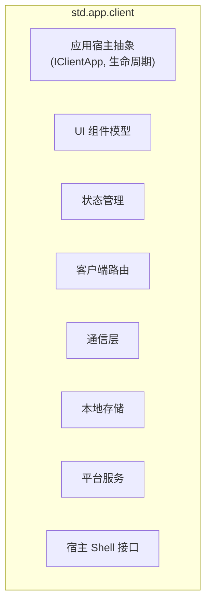
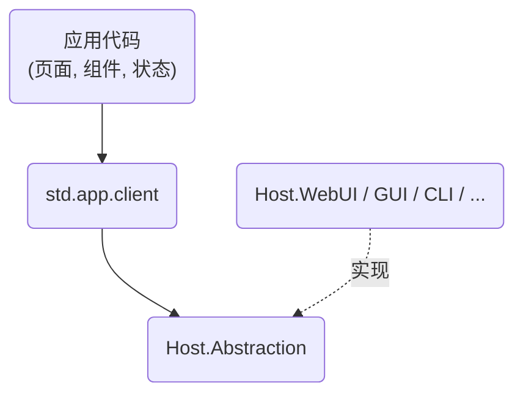

## `std.app.client` 功能清单

`std.app.client` 是标准库中的 **客户端应用框架**，提供构建各种客户端应用（CLI、TUI、GUI、WebUI、HUD）所需的统一抽象和基础实现。它不绑定具体宿主，而是通过
`Host.Abstraction` 适配不同运行环境。

---

### 一、核心功能模块

---

### 二、详细功能列表

| 模块            | 功能               | 说明                                                   |
|:----------------|:-------------------|:-------------------------------------------------------|
| **应用宿主**    | `IClientApp` 接口  | 客户端应用入口，管理生命周期（启动、暂停、恢复、退出） |
|                 | `ClientAppBuilder` | 构建器模式，注册服务、配置、中间件                     |
|                 | 生命周期事件       | `OnStart`, `OnStop`, `OnPause`, `OnResume`             |
| **UI 组件模型** | `IComponent`       | 统一组件接口，与宿主无关                               |
|                 | `ComponentTree`    | 组件树，描述 UI 结构                                   |
|                 | 属性绑定           | 单向/双向绑定，数据驱动更新                            |
|                 | 虚拟 DOM (可选)    | 用于 WebUI/GUI 的高效 diff 更新                        |
|                 | 渲染适配器         | 将组件树映射到具体宿主（GUI 控件、终端字符、DOM 元素） |
| **状态管理**    | `IState<T>`        | 响应式状态容器，变更时自动通知订阅者                   |
|                 | `IStore`           | 全局状态树，类似 Redux / Zustand                       |
|                 | 计算属性/派生状态  | 从已有状态派生，自动缓存                               |
|                 | 状态持久化         | 将状态自动保存到本地存储                               |
|                 | 作用域状态         | 局部状态、表单状态，不污染全局                         |
| **客户端路由**  | `IRouter`          | 基于路径/URL 的页面导航                                |
|                 | 路由定义           | 声明式路由表，支持参数、嵌套路由                       |
|                 | 导航守卫           | 前置/后置钩子 (权限、数据预加载)                       |
|                 | 深层链接           | URL 与实际视图的映射，支持回退按钮                     |
|                 | 历史记录栈         | 前进/后退管理                                          |
| **通信层**      | `IHttpClient`      | HTTP 请求抽象，支持 REST/GraphQL                       |
|                 | `IWebSocketClient` | WebSocket 连接管理，自动重连                           |
|                 | `IRealtimeClient`  | 实时通道（如 SignalR / Socket.IO）                     |
|                 | 请求/响应拦截器    | 统一处理认证、错误、重试、缓存                         |
|                 | 离线队列           | 离线时暂存请求，恢复后发送                             |
|                 | 数据同步           | 与服务器状态同步，冲突解决策略                         |
| **本地存储**    | `ILocalStorage`    | 键值存储抽象                                           |
|                 | `IFileStorage`     | 文件系统存储                                           |
|                 | `IDatabase`        | 本地数据库（SQLite 等）                                |
|                 | 加密存储           | 敏感数据本地加密                                       |
|                 | 配额管理           | 存储空间限制处理                                       |
| **平台服务**    | 剪贴板             | 读取/写入系统剪贴板                                    |
|                 | 通知               | 本地通知、推送通知                                     |
|                 | 系统托盘           | 托盘图标、菜单                                         |
|                 | 快捷键             | 全局/局部键盘快捷键注册                                |
|                 | 文件对话框         | 打开/保存文件对话框                                    |
|                 | 设备传感器         | 地理位置、加速度、陀螺仪等                             |
|                 | 相机/麦克风        | 媒体采集                                               |
| **宿主 Shell**  | `IHostShell`       | 宿主提供的原生能力接口                                 |
|                 | 窗口管理           | 创建/关闭窗口，全屏，最小化                            |
|                 | 渲染输出           | 提交帧，同步刷新                                       |
|                 | 输入抽象           | 键盘、鼠标、触摸、手柄事件                             |
|                 | 渲染上下文         | 2D/3D 渲染上下文 (OpenGL, WebGL, Vulkan, Canvas)       |
| **插件/扩展**   | 中间件管道         | 请求/响应处理链                                        |
|                 | 模块化加载         | 动态加载功能模块 (DLL/WASM)                            |
|                 | 主题系统           | 运行时切换主题，自定义样式                             |
|                 | 国际化 (i18n)      | 多语言支持，格式化日期/数字/货币                       |
|                 | 无障碍 (a11y)      | 屏幕阅读器支持，高对比度                               |

---

### 三、与宿主的适配关系

每种宿主只需实现 `IHostShell` 以及对应的渲染适配器，即可运行 `std.app.client` 应用：

| 宿主         | 渲染输出                     | 输入方式              | 主要适配点                           |
|:-------------|:-----------------------------|:----------------------|:-------------------------------------|
| `Host.CLI`   | 标准输出、ANSI 转义          | 键盘、管道            | 组件映射到命令行参数和输出           |
| `Host.TUI`   | 终端区域更新 (如 curses)     | 键盘、鼠标 (部分终端) | 组件映射到文本块，区域管理           |
| `Host.GUI`   | 原生控件 (Win32, Cocoa, GTK) | 鼠标、键盘、触摸      | 组件映射到原生控件                   |
| `Host.WebUI` | DOM / Canvas / WebGL         | 鼠标、键盘、触摸      | 组件映射到 DOM，通过 WASM 与 JS 交互 |
| `Host.HUD`   | 游戏内叠加层 (纹理)          | 手柄、键盘、鼠标      | 组件映射到游戏引擎的 UI 系统         |

---

### 四、典型应用架构

应用开发者只与 `std.app.client` 的 API 交互，不直接依赖具体宿主。切换宿主只需更改启动配置，业务逻辑和 UI
组件无需修改（只需确保组件使用抽象能力，不调用宿主特定 API）。

---

### 五、与其他模块的关系

- **依赖 `std`**：使用集合、异步、IO、网络等基础能力。
- **被 `Nyar.Compiler` 编译**：Valkyrie 源码通过编译器前端生成 HIR，经 Nyar 中端优化后，由对应目标后端生成可执行文件（CLR/Native/Wasm）。
- **无直接依赖 `Nyar.Core`**：`std.app.client` 是标准库，不直接引用编译器内部 IR，仅通过编译器工具链作为编译目标。
- **与 `std.app.server` 共享通用模块**：如通信层基础（`IHttpClient`）、状态管理基类、国际化等可能提取到共享的 `std.app` 包中。

---

如果需要，我可以进一步展开某个模块的具体接口设计，或者对比当前 `Olympus.Atlas` 的实现来确定迁移路径。