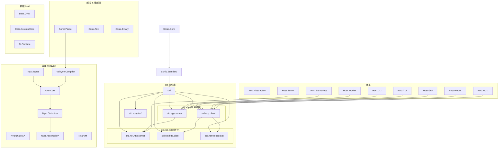

确实，把 HTTP 服务端和客户端分别塞进 `std.app.server` 和 `std.app.client` 里会导致 **同一个协议的基础实现被割裂**
，而且应用框架耦合了传输层。应该把通信基础独立出来，让应用框架只做应用逻辑的事。

---

## 修正方案：分离通信基础与应用框架

| 模块                  | 所在包                | 职责                                                                                           |
|:----------------------|:----------------------|:-----------------------------------------------------------------------------------------------|
| **HTTP 服务端核心**   | `std.net.http.server` | `HttpServer`, `HttpRequest`, `HttpResponse`, 管道基础                                          |
| **HTTP 客户端核心**   | `std.net.http.client` | `HttpClient`, 请求构造, 连接池                                                                 |
| **WebSocket**         | `std.net.websocket`   | 双向通信抽象                                                                                   |
| **应用框架 - 服务端** | `std.app.server`      | 路由、中间件、认证授权、应用生命周期<br/>**依赖** `std.net.http.server`，不自己实现 HTTP       |
| **应用框架 - 客户端** | `std.app.client`      | UI 组件、状态、客户端路由、本地存储<br/>**依赖** `std.net.http.client`，不自己实现 HTTP 客户端 |

**关键变化**：

- `std.net.http.server` 和 `std.net.http.client` 是 **通用网络库**，可以被任何项目使用，不限定于应用框架。
- `std.app.server` 依赖 `std.net.http.server`，专注提供 **业务层框架能力**（路由、中间件等）。
- `std.app.client` 依赖 `std.net.http.client`，专注提供 **UI 框架能力**，网络调用只是工具箱之一。

---

## 修正后的模块结构

```mermaid
graph TD
    subgraph "std.net (网络通信)"
        NetHttpServer("std.net.http.server")
        NetHttpClient("std.net.http.client")
        NetWebSocket("std.net.websocket")
    end

    subgraph "std.app (应用框架)"
        AppServer("std.app.server<br/>(路由, 中间件)")
        AppClient("std.app.client<br/>(UI 组件, 状态)")
    end

    subgraph "宿主"
        Host.Abstraction
        Host.Server
        Host.CLI / GUI / WebUI / ...
    end

    NetHttpServer --> std
    NetHttpClient --> std
    NetWebSocket --> std
    AppServer --> NetHttpServer
    AppClient --> NetHttpClient
    AppClient --> NetWebSocket
    Host.Server --> NetHttpServer
    Host.CLI / GUI / WebUI --> AppClient
```

---

## 完整生态架构（修正后）



现在职责清晰：

- 网络协议属于 `std.net`，与应用框架解耦。
- `std.app.server` / `client` 专注业务框架，协议实现来自底层。
- 同样的 `std.net.http.client` 可以在脚本、CLI 工具、`std.app.server` 内部出站调用中复用，不再分裂。