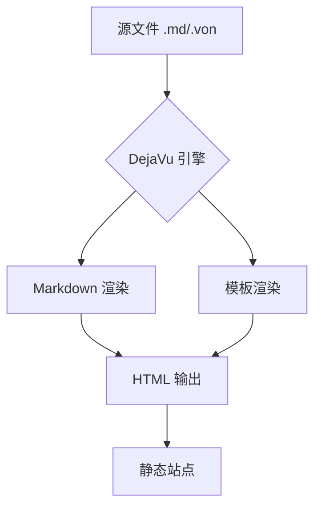
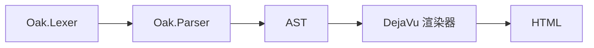

## 快速开始

### 安装

通过 .NET CLI 安装 DejaVu：

```bash
dotnet tool install --global DejavuEngine
```

或者作为项目依赖引用：

```bash
dotnet add package DejavuEngine
```

### 创建第一个站点

1. **初始化站点目录**

```bash
dejavu site init my-site
cd my-site
```

2. **站点结构**

初始化后的目录结构如下：

```
my-site/
├── config.von          # 站点配置（VON 格式）
├── content/            # 内容目录
│   └── posts/          # 博客文章
├── layouts/            # 模板布局
│   ├── default.dora    # 默认布局
│   ├── index.dora      # 首页布局
│   └── post.dora       # 文章布局
├── static/             # 静态资源
│   ├── css/
│   └── js/
└── data/               # 数据文件
```

3. **创建第一篇文章**

在 `content/posts/` 下创建 Markdown 文件：

```markdown
---
title: 我的第一篇文章
date: 2026-01-01
tags: [入门, 教程]
---

这是我的第一篇 DejaVu 博客文章！
```

4. **构建并预览**

```bash
dejavu site build
dejavu site serve --port 8080
```

打开浏览器访问 `http://localhost:8080` 即可预览。

### 配置站点

编辑 `config.von` 自定义站点：

```von
{
  title: "我的博客",
  description: "一个使用 DejaVu 构建的博客",
  language: "zh-CN",
  navigation: [
    {"首页": "/"},
    {"文章": "/posts/"}
  ]
}
```

### 内置增强功能

DejaVu 内置了三种常用增强，无需插件：

#### 语法高亮

所有代码块自动高亮，支持 200+ 语言：

```csharp
using Dejavu;

var renderer = new DejavuRenderer();
var result = renderer.Render("Hello, <% name %>!", new Dictionary<string, object>
{
    ["name"] = "World"
});

Console.WriteLine(result); // Hello, World!
```

```python
def fibonacci(n: int) -> list[int]:
    """生成斐波那契数列"""
    a, b = 0, 1
    result = []
    for _ in range(n):
        result.append(a)
        a, b = b, a + b
    return result
```

```rust
fn main() {
    let numbers: Vec<i32> = (1..=10).collect();
    let sum: i32 = numbers.iter().sum();
    println!("Sum: {}", sum);
}
```

#### 数学公式

行内公式：质能方程 $E = mc^2$，欧拉公式 $e^{i\pi} + 1 = 0$。

块级公式——高斯积分：

$$\int_{-\infty}^{\infty} e^{-x^2} dx = \sqrt{\pi}$$

麦克斯韦方程组：

$$\nabla \times \mathbf{E} = -\frac{\partial \mathbf{B}}{\partial t}$$

$$\nabla \times \mathbf{B} = \mu_0 \mathbf{J} + \mu_0 \varepsilon_0 \frac{\partial \mathbf{E}}{\partial t}$$

#### 图表



编译管线流程：



### 下一步

- 了解 [模板语法](/docs/guide/template-syntax/) 来自定义页面布局
- 查看 [站点配置](/docs/guide/configuration/) 了解所有配置选项
